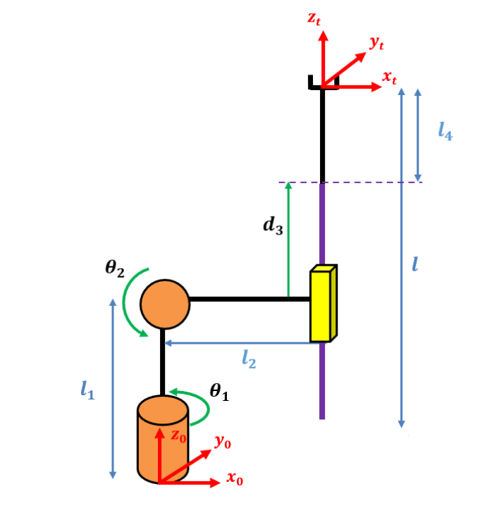

# Serial Robot Dynamics

Implementation of Lagrangian-based dynamics formulation for a 3-DOF serial robot, including forward and inverse dynamics simulation, and robustness validation under model uncertainty.

## Problem Description



We analyze a **3-DOF serial robot** with:
- **Link 1:** Revolute joint (θ₁), length l₂ = 1.6 m
- **Link 2:** Revolute joint (θ₂), length l = 1.2 m, center of mass at l/2
- **Link 3:** Prismatic joint (d₃), variable length
- **End-effector:** Connected to platform with fixed link l₄
- **Load:** Platform mass M variable (nominal 0.5 kg, testing 0-1 kg)

### Robot Parameters

- l₂ = 1.6 m (link 2 length)
- l = 1.2 m (link 3 length)
- l₄ = 0.3 m (fixed end connection)
- m₂ = 10.8 kg (link 2 mass)
- m₃ = 8.4 kg (link 3 mass)
- M = 0.5 kg (nominal load, variable 0-1 kg in testing)
- g = 9.81 m/s²

---

## Mathematical Formulation

### Lagrangian Mechanics Foundation

The robot dynamics are derived from the **Euler-Lagrange equations**:

```
d/dt(∂L/∂q̇ᵢ) - ∂L/∂qᵢ = τᵢ

where:
  L = T - V (Lagrangian)
  T = kinetic energy
  V = potential energy
  τᵢ = torque/force at joint i
```

### Key Equation: Dynamics Matrix Form

```
H(q)·q̈ + C(q, q̇)·q̇ + G(q) = τ
```

Where:
- **H(q)** = Inertia matrix (3×3, depends on configuration q)
- **C(q, q̇)** = Coriolis and centrifugal matrix (3×3)
- **G(q)** = Gravity vector (3×1)
- **τ** = Torque/force input vector

### Inertia Matrix H(q)

The inertia matrix represents resistance to acceleration:

```
H₁₁ = M·(d₃·sin(θ₂) - l₂·cos(θ₂) + l₄·sin(θ₂))²
      + m₃·(sin(θ₂)·(d₃ - l/2 + l₄) - l₂·cos(θ₂))²
      + (l₂²·m₂·cos(θ₂)²)/3
      + (l²·m₃·sin(θ₂)²)/12

H₂₂ = m₃·(d₃ - l/2 + l₄)² + M·(d₃ + l₄)² + M·l₂²
      + (l₂²·m₂)/3 + (l²·m₃)/12 + l₂²·m₃

H₂₃ = H₃₂ = l₂·(M + m₃)

H₃₃ = M + m₃
```

### Gravity Vector G(q)

The gravity vector represents gravitational forces/torques:

```
G₁ = 0  (no gravity effect on first revolute joint)

G₂ = -g·(M·(d₃·sin(θ₂) - l₂·cos(θ₂) + l₄·sin(θ₂))
         + m₃·(sin(θ₂)·(d₃ - l/2 + l₄) - l₂·cos(θ₂))
         - (l₂·m₂·cos(θ₂))/2)

G₃ = g·cos(θ₂)·(M + m₃)
```

---

## Algorithms

### 1. Inverse Dynamics

**Problem:** Given desired trajectory [qd(t), q̇d(t), q̈d(t)], find required torques τ(t)

```
For each time step t:
  1. Compute H(q_desired)  [inertia matrix]
  2. Compute C(q_desired, q_dot_desired)  [Coriolis/centrifugal]
  3. Compute G(q_desired)  [gravity]
  4. τ = H·q̈d + C·q̇d + G
```

### 2. Forward Dynamics

**Problem:** Given torques τ(t), compute resulting motion q(t)

```
Formulate ODE system:
  dq/dt = q̇
  dq̇/dt = H⁻¹(q)·(τ(t) - C(q, q̇)·q̇ - G(q))

Use numerical integration (ODE45):
  [t, X] = ode45(@state_eq, t_span, X₀)
  where X = [q, q̇]ᵀ
```

---

## Function Summary

| Function | Purpose |
|---|---|
| dynamics_mat.m | Compute H, C, G matrices |
| tau_plan.m | Inverse dynamics planning |
| state_eq.m | ODE function for forward dynamics |
| forward_kin.m | End-effector position |
| inverse_kin.m | Joint angles from position |
| jacobian_mat.m | Compute Jacobian |
| main.m | Complete simulation |

---

## Results & Validation

### Nominal Case (M = 0.5 kg match)
- **Tracking Error:** < 0.1%
- **Validation:** Inverse dynamics computed torques produce desired trajectory

### Load Uncertainty (M = 1.0 kg actual)
- **Tracking Error:** 0.3-0.5% depending on trajectory
- **Implication:** Robustness requires adaptive or robust control

---

## References

1. Craig, J. J. (2005). Introduction to Robotics: Mechanics and Control
2. Tsai, L. W. (1999). Robot Analysis: The Mechanics of Serial and Parallel Manipulators
3. Siciliano, B., Sciavicco, L., Villani, L., & Oriolo, G. (2009). Robotics: Modelling, Planning and Control

**Execution time:** main.m ~30-60 seconds (includes 3 scenarios + plots)
